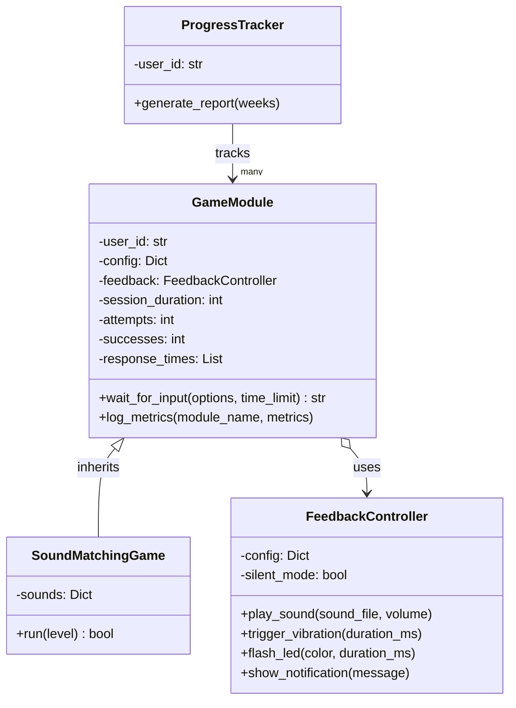
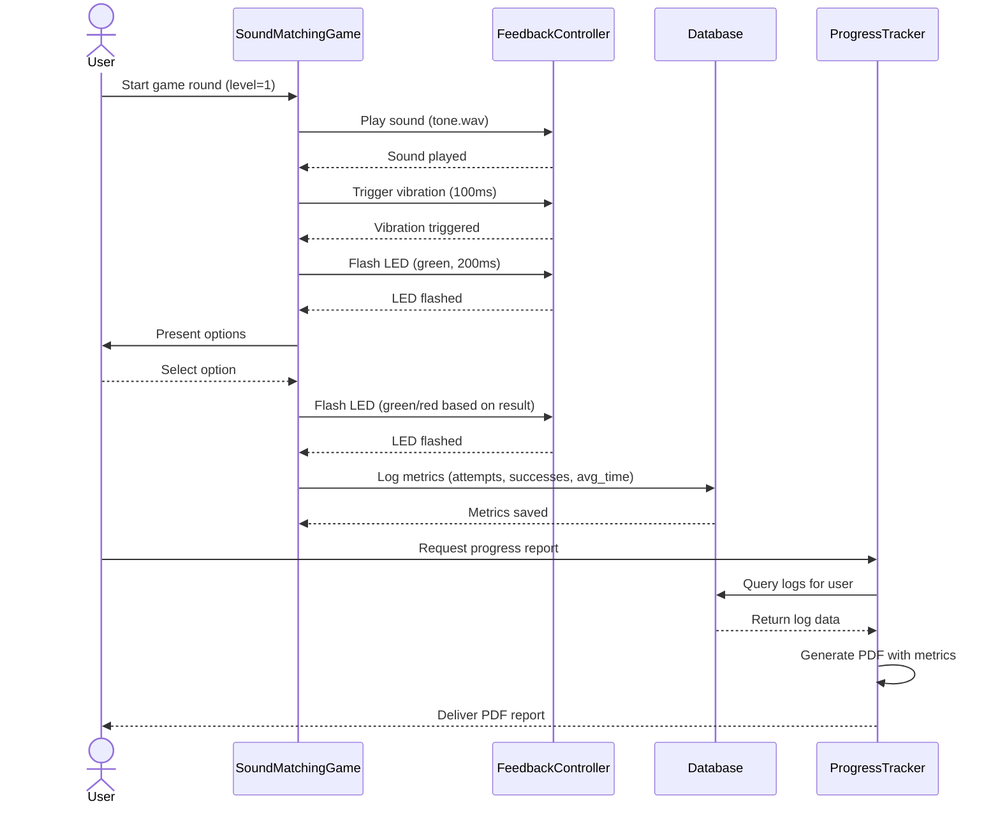
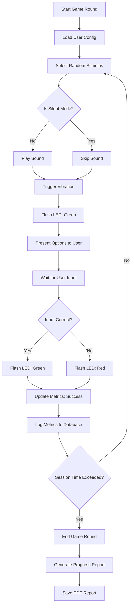

# Cognitive Training Framework – Modular Architecture

## Overview
This project is a **modular cognitive training framework** designed to demonstrate:
- **Clean architecture & modular design**
- **Hardware abstraction layer**
- **Data persistence (SQLite + JSON)**
- **Real-time feedback system**
- **Analytics and PDF reporting**

It’s not just a game — it’s a **framework** ready for integration into embedded devices, training systems, and serious games.

---

## Architecture
**Main Components:**
1. **HardwareInterface**
   - Abstracts hardware feedback: sound, vibration, LED, display.
   - Simulated mode for testing without physical devices.

---

### Class Diagram



---

## Sequence Diagram



---

2. **GameModule**
   - Base class for training modules.
   - Manages logging, session tracking, and metrics persistence.

3. **SoundMatchingGame**
   - Example implementation: sound-to-image association challenge.
   - Uses vibration, LED flash, and audio feedback.

4. **ProgressTracker**
   - Reads logs from SQLite.
   - Generates visual analytics with matplotlib.
   - Outputs PDF reports with status indicators.

---

## Tech Stack
- **Python 3.9+**
- **SQLite3** – persistent storage
- **JSON** – redundant logging
- **pygame** – audio feedback
- **matplotlib** – charting
- **pandas** – data handling
- **FPDF** – PDF report generation

---

## Example Flow
1. User plays the `SoundMatchingGame`.
2. Each attempt is logged in **SQLite** and **JSON**.
3. `ProgressTracker` compiles weekly metrics and generates a PDF report.

---

### Flowchart



---

## Installation
```bash
pip install -r requirements.txt

```python
# Cognitive Training Framework – Modular Architecture

## Overview
This project is a **modular cognitive training framework** designed to demonstrate:
- **Clean architecture & modular design**
- **Hardware abstraction layer**
- **Data persistence (SQLite + JSON)**
- **Real-time feedback system**
- **Analytics and PDF reporting**

It’s not just a game — it’s a **framework** ready for integration into embedded devices, training systems, and serious games.

---

## Architecture
**Main Components:**
1. **HardwareInterface**
   - Abstracts hardware feedback: sound, vibration, LED, display.
   - Simulated mode for testing without physical devices.

2. **GameModule**
   - Base class for training modules.
   - Manages logging, session tracking, and metrics persistence.

3. **SoundMatchingGame**
   - Example implementation: sound-to-image association challenge.
   - Uses vibration, LED flash, and audio feedback.

4. **ProgressTracker**
   - Reads logs from SQLite.
   - Generates visual analytics with matplotlib.
   - Outputs PDF reports with status indicators.

---

## Tech Stack
- **Python 3.9+**
- **SQLite3** – persistent storage
- **JSON** – redundant logging
- **pygame** – audio feedback
- **matplotlib** – charting
- **pandas** – data handling
- **FPDF** – PDF report generation

---

## Example Flow
1. User plays the `SoundMatchingGame`.
2. Each attempt is logged in **SQLite** and **JSON**.
3. `ProgressTracker` compiles weekly metrics and generates a PDF report.

---

## Installation
```bash
pip install -r requirements.txt
```
