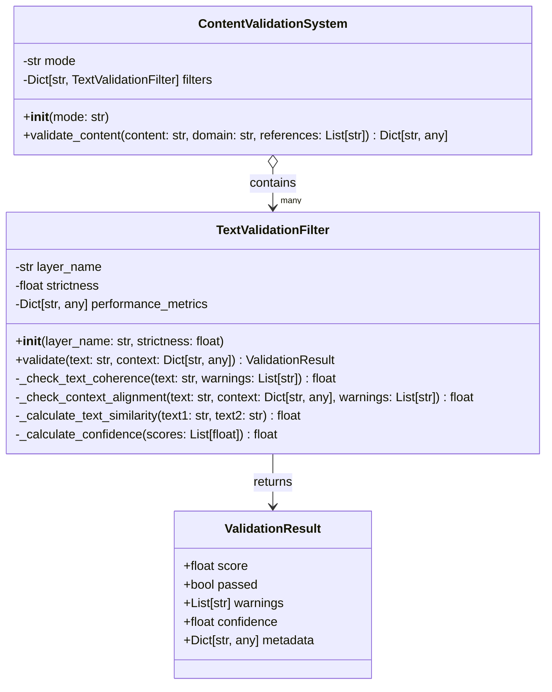

# Content Validation System – Modular Architecture

## Overview

This project is a **modular content validation system** designed to analyze textual data based on multiple criteria, including semantic coherence and context alignment.

It demonstrates:

- Clean **object-oriented design** with **dataclasses**  
- Dependency fallback for numerical operations (uses NumPy if available, otherwise custom math)  
- Modular filters allowing easy extension  
- Detailed metrics including warnings, confidence scores, and metadata  
- Straightforward CLI usage example  

---

## Architecture

### Class Diagram


### Components

1. **`TextValidationFilter`**  
   - Base filter for validating textual content on multiple axes  
   - Implements coherence and context alignment checks  
   - Returns rich `ValidationResult` objects  

2. **`ContentValidationSystem`**  
   - Composite system orchestrating multiple filters  
   - Aggregates results and computes overall pass/fail and score  
   - Easily extensible by adding new filters  

3. **Math abstraction**  
   - Uses NumPy if installed for efficient mean and std computations  
   - Otherwise, falls back to custom implementations  

---

## Tech Stack

- **Python 3.7+**  
- **NumPy** (optional, fallback available)  
- **Dataclasses** for clean data structures  
- **Logging** for debug output  

---

## Usage

```bash
python validation_system.py

```python
import re
import json
import logging
from dataclasses import dataclass, asdict
from datetime import datetime
from typing import Dict, List, Any, Optional

try:
    import numpy as np
    NUMPY_AVAILABLE = True
except ImportError:
    NUMPY_AVAILABLE = False

# Setup logger
logger = logging.getLogger(__name__)
logger.setLevel(logging.DEBUG)
ch = logging.StreamHandler()
formatter = logging.Formatter("[%(levelname)s] %(message)s")
ch.setFormatter(formatter)
logger.addHandler(ch)


# ===== Fallback math utilities if numpy missing =====
class MathFallback:
    @staticmethod
    def mean(data: List[float]) -> float:
        return sum(data) / len(data) if data else 0.0

    @staticmethod
    def std(data: List[float]) -> float:
        if not data:
            return 0.0
        mean_val = sum(data) / len(data)
        return (sum((x - mean_val) ** 2 for x in data) / len(data)) ** 0.5


_math_lib = np if NUMPY_AVAILABLE else MathFallback()


# ===== Data Model =====
@dataclass
class ValidationResult:
    score: float
    passed: bool
    warnings: List[str]
    confidence: float
    metadata: Dict[str, Any]


# ===== Validation Filter Base Class =====
class TextValidationFilter:
    """
    Base class for text content validation filters.
    """

    def __init__(self, layer_name: str, strictness: float = 0.7) -> None:
        self.layer_name = layer_name
        self.strictness = strictness
        self.performance_metrics = {'total_checks': 0, 'avg_time': 0.0}

    def validate(self, text: str, context: Dict[str, Any]) -> ValidationResult:
        start_time = datetime.now()
        warnings: List[str] = []
        score_components: List[float] = []

        coherence_score = self._check_text_coherence(text, warnings)
        score_components.append(coherence_score)

        context_score = self._check_context_alignment(text, context, warnings)
        score_components.append(context_score)

        overall_score = _math_lib.mean(score_components)
        confidence = self._calculate_confidence(score_components)
        processing_time = (datetime.now() - start_time).total_seconds()

        logger.debug(f"{self.layer_name}: overall_score={overall_score:.3f}, confidence={confidence:.3f}, time={processing_time:.3f}s")

        return ValidationResult(
            score=overall_score,
            passed=overall_score >= self.strictness,
            warnings=warnings,
            confidence=confidence,
            metadata={
                'coherence_score': coherence_score,
                'context_score': context_score,
                'processing_time_s': processing_time
            }
        )

    def _check_text_coherence(self, text: str, warnings: List[str]) -> float:
        sentences = [s.strip() for s in re.split(r'[.!?]+', text) if s.strip()]

        if len(sentences) < 2:
            return 0.8  # Not enough sentences to evaluate properly

        overlap_scores: List[float] = []
        for i in range(len(sentences) - 1):
            words1 = set(re.findall(r'\b\w{3,}\b', sentences[i].lower()))
            words2 = set(re.findall(r'\b\w{3,}\b', sentences[i + 1].lower()))

            union = len(words1 | words2)
            overlap = len(words1 & words2)

            score = overlap / union if union > 0 else 0
            overlap_scores.append(score)

        coherence_score = _math_lib.mean(overlap_scores) * 2 if overlap_scores else 0.5
        coherence_score = min(1.0, coherence_score)

        if coherence_score < 0.3:
            warnings.append("Low consistency between sentences.")

        return coherence_score

    def _check_context_alignment(self, text: str, context: Dict[str, Any], warnings: List[str]) -> float:
        references = context.get('references', [])
        if not references:
            return 0.7  # Default score without references

        similarity_scores: List[float] = []
        for ref_text in references[:3]:
            similarity_scores.append(self._calculate_text_similarity(text, ref_text))

        avg_similarity = _math_lib.mean(similarity_scores) if similarity_scores else 0.7

        if avg_similarity < 0.3:
            warnings.append("Low alignment with provided references.")

        return avg_similarity

    def _calculate_text_similarity(self, text1: str, text2: str) -> float:
        stop_words = {'the', 'and', 'is', 'in', 'to'}
        words1 = set(re.findall(r'\b\w{3,}\b', text1.lower())) - stop_words
        words2 = set(re.findall(r'\b\w{3,}\b', text2.lower())) - stop_words

        intersection = len(words1 & words2)
        union = len(words1 | words2)

        return intersection / union if union > 0 else 0.3

    def _calculate_confidence(self, scores: List[float]) -> float:
        variance = _math_lib.std(scores) if len(scores) > 1 else 0.0
        confidence = max(0.5, 1.0 - variance)
        return confidence


# ===== Main Validation System =====
class ContentValidationSystem:
    """
    Composite system that applies multiple validation filters on content.
    """

    def __init__(self, mode: str = "balanced") -> None:
        self.mode = mode
        self.filters: Dict[str, TextValidationFilter] = {
            'coherence': TextValidationFilter("coherence_check", strictness=0.7),
            # Extend with more filters as needed
        }

    def validate_content(self, content: str, domain: str = "general", references: Optional[List[str]] = None) -> Dict[str, Any]:
        context = {
            'domain': domain,
            'references': references or []
        }

        results = {name: flt.validate(content, context) for name, flt in self.filters.items()}

        overall_score = _math_lib.mean([res.score for res in results.values()])
        passed = all(res.passed for res in results.values())
        warnings = [warn for res in results.values() for warn in res.warnings]

        return {
            'score': overall_score,
            'passed': passed,
            'warnings': warnings,
            'details': {name: asdict(res) for name, res in results.items()}
        }


# ===== Example usage =====
if __name__ == "__main__":
    system = ContentValidationSystem(mode="strict")
    test_content = (
        "Studies suggest the new approach may improve outcomes, but more data is needed."
    )
    references = ["Article published in a scientific journal"]
    result = system.validate_content(test_content, domain="research", references=references)
    print(json.dumps(result, indent=2, ensure_ascii=False))
```
