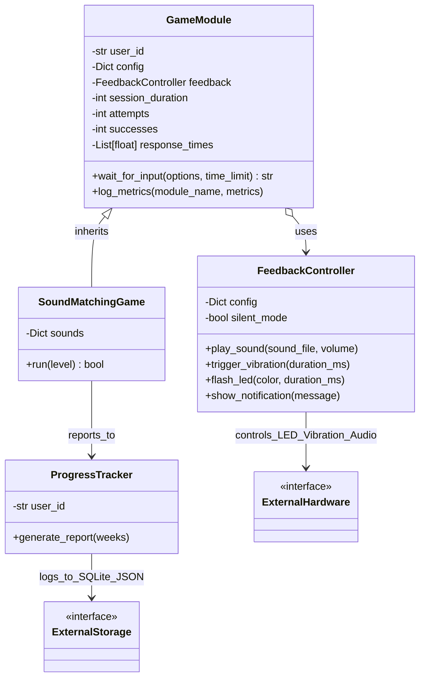
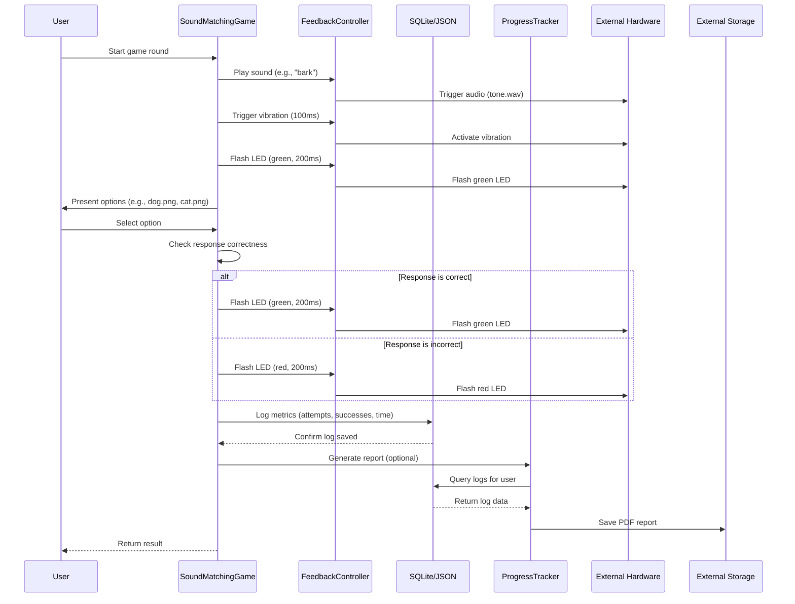

# Sound Matching Cognitive Training Framework

## Overview
A modular Python framework for building cognitive training and sensory association games, featuring:
- **Hardware abstraction** for audio, LED, and vibration feedback
- **Persistent logging** via SQLite and JSON
- **Analytics & PDF reports** for progress tracking
- **Pluggable game modules**

---

## Architecture

### Class Diagram


### Sequence Diagram


- **HardwareInterface**
  - Unified control of audio, vibration, and LED feedback.
- **GameModule**
  - Base class for tracking attempts, successes, and response times.
- **SoundMatchingGame**
  - Sample implementation for matching sounds to images.
- **ProgressTracker**
  - Analytics engine generating weekly metrics and PDF reports.

---

## Tech Stack
- Python 3.9+
- SQLite3
- pandas
- pygame
- matplotlib
- fpdf

---

## Installation
```bash
pip install -r requirements.txt

```python
import time
import random
import json
import os
import sqlite3
import pandas as pd
import pygame
import matplotlib.pyplot as plt
from fpdf import FPDF
from typing import Dict, List, Any


# ================= Database =================
def initialize_db():
    """Initialize SQLite database for logging user sessions."""
    conn = sqlite3.connect("user_data.db")
    c = conn.cursor()
    c.execute("""
        CREATE TABLE IF NOT EXISTS logs (
            user TEXT,
            module TEXT,
            attempts INTEGER,
            successes INTEGER,
            avg_time REAL,
            timestamp REAL
        )
    """)
    conn.commit()
    conn.close()


# ================= Hardware Abstraction =================
class HardwareInterface:
    """Abstract layer to manage tactile, visual, and auditory feedback."""

    def __init__(self, config: Dict[str, Any]):
        self.config = config
        pygame.mixer.init()

    def play_sound(self, sound_file: str, volume: float = 0.5):
        if not self.config.get("silent_mode", False):
            try:
                max_volume = self.config.get("max_volume", 60) / 100
                pygame.mixer.music.load(sound_file)
                pygame.mixer.music.set_volume(min(volume, max_volume))
                pygame.mixer.music.play()
            except Exception as e:
                print(f"[Hardware] Audio error: {e}")

    def trigger_vibration(self, duration_ms: int = 100):
        if not self.config.get("silent_mode", False):
            intensity = self.config.get("vibration_intensity", 1)
            print(f"Vibrating at {intensity}mA for {duration_ms}ms")

    def flash_led(self, color: str = "green", duration_ms: int = 200):
        if not self.config.get("silent_mode", False):
            print(f"Flashing {color} LED for {duration_ms}ms")

    def show_notification(self, message: str):
        print(f"Notification: {message}")


# ================= Base Module =================
class GameModule:
    """Base class for interactive game modules with persistent logging."""

    def __init__(self, user_id: str, config: Dict[str, Any]):
        self.user_id = user_id
        self.config = config
        self.hardware = HardwareInterface(config)
        self.attempts = 0
        self.successes = 0
        self.response_times: List[float] = []

    def wait_for_input(self, options: List[str], time_limit: float) -> str:
        """Simulates waiting for user input (placeholder)."""
        time.sleep(random.uniform(0, time_limit))
        return random.choice(options)

    def log_metrics(self, module_name: str, metrics: Dict[str, Any]):
        """Logs metrics into SQLite and JSON."""
        initialize_db()
        log_entry = {
            "user": self.user_id,
            "module": module_name,
            "attempts": metrics.get("attempts", 0),
            "successes": metrics.get("successes", 0),
            "avg_time": metrics.get("avg_time", 0),
            "timestamp": time.time()
        }

        # JSON backup log
        with open(f"{self.user_id}_log.json", "a") as f:
            json.dump(log_entry, f)
            f.write("\n")

        # SQLite persistent log
        conn = sqlite3.connect("user_data.db")
        c = conn.cursor()
        c.execute("""
            INSERT INTO logs (user, module, attempts, successes, avg_time, timestamp)
            VALUES (?, ?, ?, ?, ?, ?)
        """, (
            log_entry["user"], log_entry["module"], log_entry["attempts"],
            log_entry["successes"], log_entry["avg_time"], log_entry["timestamp"]
        ))
        conn.commit()
        conn.close()


# ================= Game Implementation =================
class SoundMatchingGame(GameModule):
    """Game module for sound-image matching."""

    def __init__(self, user_id: str, config: Dict[str, Any]):
        super().__init__(user_id, config)
        self.sounds = {
            "bark": "dog.png",
            "meow": "cat.png",
            "bell": "bell.png"
        }

    def run(self, level: int = 1) -> bool:
        sound = random.choice(list(self.sounds.keys()))
        
        if not self.config.get("silent_mode", False):
            print(f"Playing sound: {sound}")
            self.hardware.trigger_vibration(100)
            self.hardware.flash_led("green", 200)
            self.hardware.play_sound("tone.wav", volume=0.3)

        # Generate options
        options = [self.sounds[sound]] + random.sample(
            [v for k, v in self.sounds.items() if k != sound],
            min(2, len(self.sounds) - 1)
        )
        random.shuffle(options)

        # Track response time
        start_time = time.time()
        response = self.wait_for_input(options, 5)
        response_time = time.time() - start_time

        # Check correctness
        correct = response == self.sounds[sound]
        self.attempts += 1
        if correct:
            self.successes += 1
            self.hardware.flash_led("green", 200)
        else:
            self.hardware.flash_led("red", 200)

        self.response_times.append(response_time)
        metrics = {
            "attempts": 1,
            "successes": 1 if correct else 0,
            "avg_time": response_time,
            "level": level
        }
        self.log_metrics("sound_matching", metrics)
        return correct


# ================= Progress Tracker =================
class ProgressTracker:
    """Tracks and generates PDF reports of user progress."""

    def __init__(self, user_id: str):
        self.user_id = user_id

    def generate_report(self, weeks: int = 4):
        initialize_db()
        conn = sqlite3.connect("user_data.db")
        df = pd.read_sql_query("SELECT * FROM logs WHERE user = ?", conn, params=(self.user_id,))
        conn.close()

        if df.empty:
            print(f"No data for User {self.user_id[-4:]}")
            return

        df['week'] = pd.to_datetime(df['timestamp'], unit='s').dt.isocalendar().week
        weekly_avg_time = df.groupby('week')['avg_time'].mean()
        weekly_successes = df.groupby('week')['successes'].sum()
        weekly_engagement = df.groupby('week')['attempts'].apply(lambda x: (x > 0).mean())

        plt.figure(figsize=(6, 4))
        plt.plot(weekly_avg_time.index[-weeks:], weekly_avg_time.values[-weeks:], 'b-', label='Avg Response Time (s)')
        plt.plot(weekly_successes.index[-weeks:], weekly_successes.values[-weeks:] / 10, 'r-', label='Successes /10')
        plt.plot(weekly_engagement.index[-weeks:], weekly_engagement.values[-weeks:], 'g-', label='Engagement')
        plt.title(f"Weekly Progress (User {self.user_id[-4:]})")
        plt.xlabel("Week")
        plt.ylabel("Metrics")
        plt.legend()
        plt.savefig("progress.png")
        plt.close()

        pdf = FPDF()
        pdf.add_page()
        pdf.set_font("Arial", size=12)
        pdf.cell(0, 10, f"Progress Report for User {self.user_id[-4:]}", ln=True, align="C")
        status = "😊" if weekly_avg_time.iloc[-1] < 3 and weekly_successes.iloc[-1] > 0.8 * df['attempts'].sum() else "😢"
        pdf.cell(0, 10, f"Status: {status}", ln=True, align="C")
        pdf.image("progress.png", x=10, y=20, w=180)
        pdf.output(f"report_{self.user_id}.pdf")
        os.remove("progress.png")


# ================= Example Run =================
if __name__ == "__main__":
    config = {
        "max_volume": 60,
        "vibration_intensity": 1,
        "silent_mode": False
    }
    game = SoundMatchingGame(user_id="user123", config=config)
    result = game.run(level=1)
    print(f"Game result: {'Success' if result else 'Failure'}")

    tracker = ProgressTracker(user_id="user123")
    tracker.generate_report(weeks=4)
```
