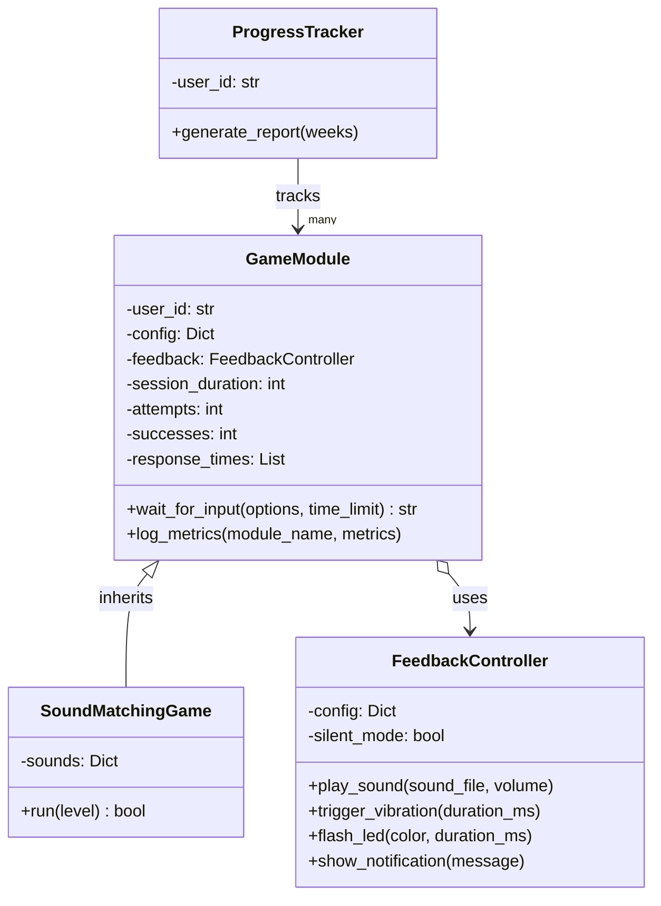

```mermaid
classDiagram
    class FeedbackController {
        -config: Dict
        -silent_mode: bool
        +play_sound(sound_file, volume)
        +trigger_vibration(duration_ms)
        +flash_led(color, duration_ms)
        +show_notification(message)
    }

    class GameModule {
        -user_id: str
        -config: Dict
        -feedback: FeedbackController
        -session_duration: int
        -attempts: int
        -successes: int
        -response_times: List
        +wait_for_input(options, time_limit) str
        +log_metrics(module_name, metrics)
    }

    class SoundMatchingGame {
        -sounds: Dict
        +run(level) bool
    }

    class ProgressTracker {
        -user_id: str
        +generate_report(weeks)
    }

    GameModule <|-- SoundMatchingGame : inherits
    GameModule o--> FeedbackController : uses
    ProgressTracker --> "many" GameModule : tracks
```
