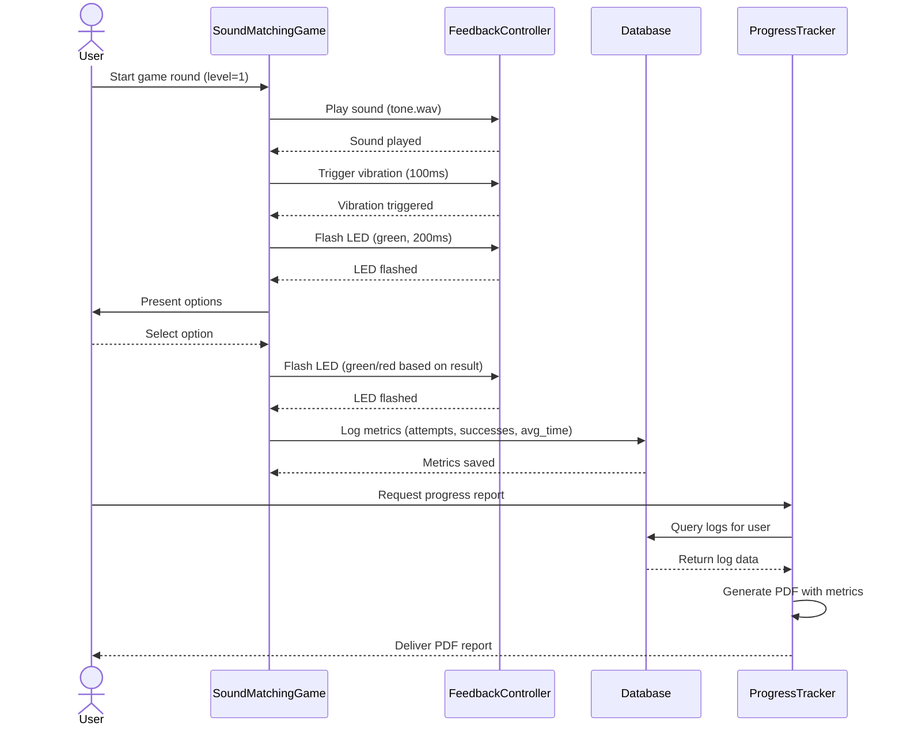

```mermaid
sequenceDiagram
    actor User
    participant Game as SoundMatchingGame
    participant Feedback as FeedbackController
    participant DB as Database
    participant Report as ProgressTracker

    User->>Game: Start game round (level=1)
    Game->>Feedback: Play sound (tone.wav)
    Feedback-->>Game: Sound played
    Game->>Feedback: Trigger vibration (100ms)
    Feedback-->>Game: Vibration triggered
    Game->>Feedback: Flash LED (green, 200ms)
    Feedback-->>Game: LED flashed
    Game->>User: Present options
    User-->>Game: Select option
    Game->>Feedback: Flash LED (green/red based on result)
    Feedback-->>Game: LED flashed
    Game->>DB: Log metrics (attempts, successes, avg_time)
    DB-->>Game: Metrics saved
    User->>Report: Request progress report
    Report->>DB: Query logs for user
    DB-->>Report: Return log data
    Report->>Report: Generate PDF with metrics
    Report-->>User: Deliver PDF report
```
