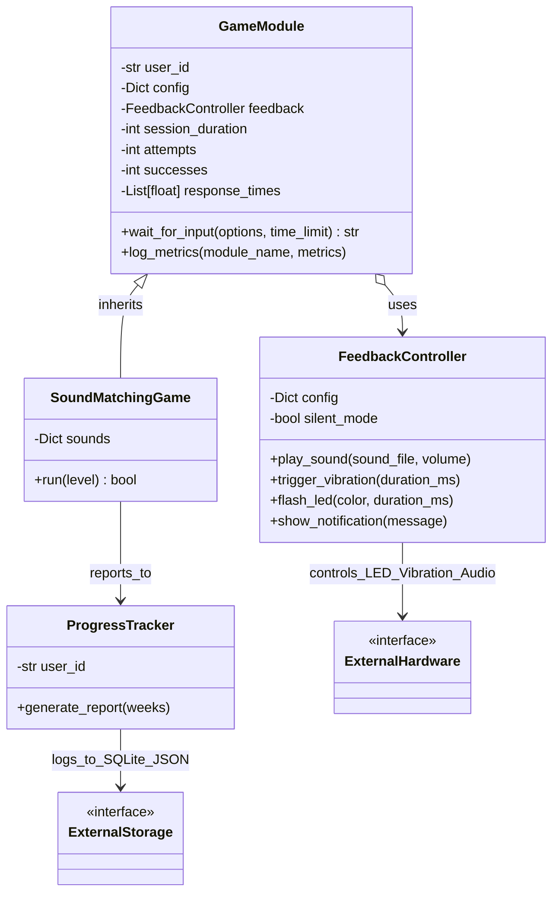

```mermaid
classDiagram
    class FeedbackController {
        -Dict config
        -bool silent_mode
        +play_sound(sound_file, volume)
        +trigger_vibration(duration_ms)
        +flash_led(color, duration_ms)
        +show_notification(message)
    }

    class GameModule {
        -str user_id
        -Dict config
        -FeedbackController feedback
        -int session_duration
        -int attempts
        -int successes
        -List[float] response_times
        +wait_for_input(options, time_limit) str
        +log_metrics(module_name, metrics)
    }

    class SoundMatchingGame {
        -Dict sounds
        +run(level) bool
    }

    class ProgressTracker {
        -str user_id
        +generate_report(weeks)
    }

    GameModule <|-- SoundMatchingGame : inherits
    GameModule o--> FeedbackController : uses
    SoundMatchingGame --> ProgressTracker : reports_to
    FeedbackController --> ExternalHardware : controls_LED_Vibration_Audio
    ProgressTracker --> ExternalStorage : logs_to_SQLite_JSON

    class ExternalHardware {
        <<interface>>
    }

    class ExternalStorage {
        <<interface>>
    }
```
