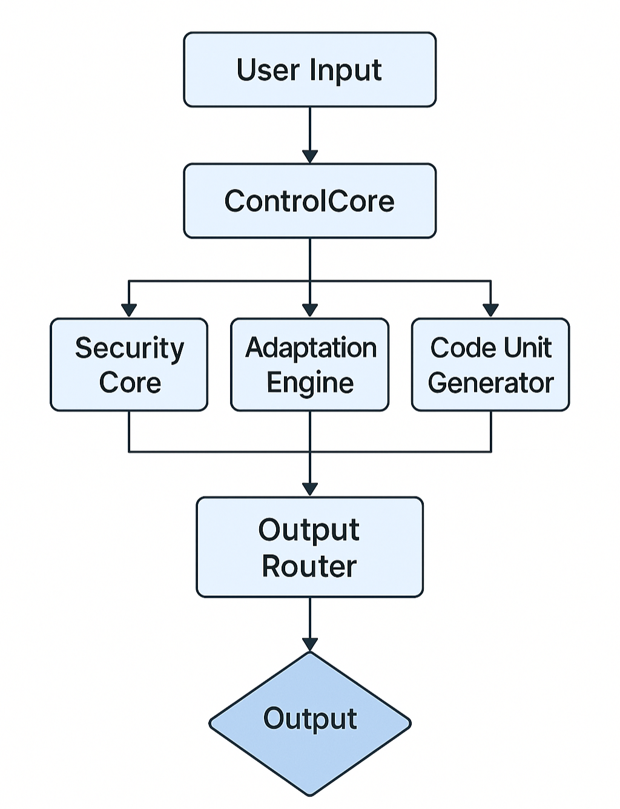
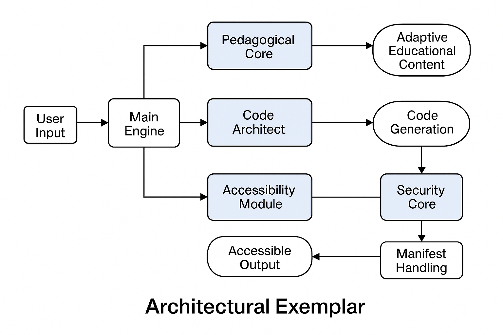
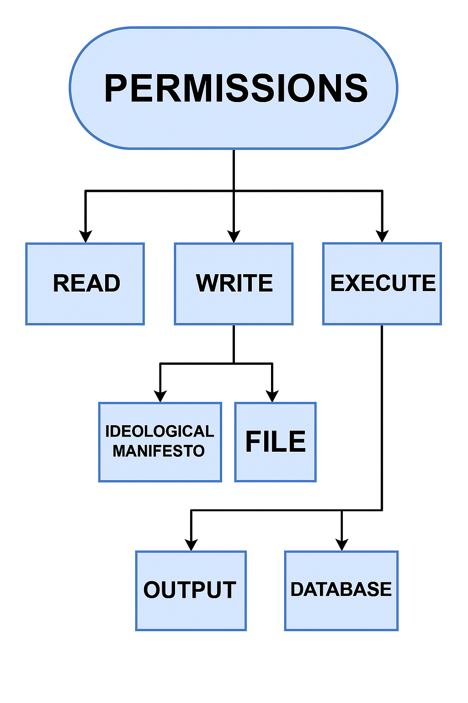
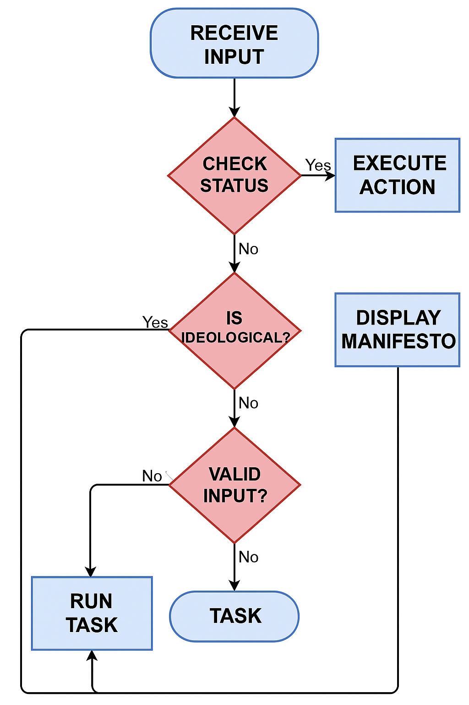

# Modular Architecture Showcase (Anonymized)

[](https://andersonolivieri.carrd.co)


## 🗂️ Table of Contents

- [🧩 Modular System Architecture](#-modular-system-architecture-anonymized-technical-showcase)
- [🔧 Components Overview](#-components-overview)
- [⚙️ Design Goals](#-design-goals)
- [🧠 Abstracted Logic Flow](#-abstracted-logic-flow)
- [🧱 Code Architecture Vault](#-code-architecture-vault)
- [📦 Sample Modules](#-sample-modules)  
  - [🔒 securitycore.py](#-sample-securitycorepy)
  - [🕹️ adaptation_engine.py](#-sample-adaptation_enginepy)
  - [🤖 codeunitgenerator.py](#-sample-codeunitgeneratorpy)
- [📊 System Schematics](#-system-schematics)
- [📄 Architectural Notes](#-architectural-notes)
- [🔒 Intellectual Property Notice](#-intellectual-property-notice)
- [📞 Contact](#-contact)

> 🚧 *This architecture is part of an ongoing R&D process. Code and logic are illustrative, non-deployable, and covered under a pending patent.*

---

## 🧩 Modular System Architecture (Anonymized Technical Showcase)  

 This page presents a software architecture designed for complex, constraint-aware, modular applications.
No functionality, project, or proprietary domain is disclosed.
(This is a structural demonstration only.)

---

#### 🔧 Components Overview

- ControlCore: central logic router

- SecurityCore: handles rules and internal enforcement

- AdaptationEngine: adjusts outputs based on dynamic parameters

- CodeUnitGenerator: builds executable logic units + tests

- IOhub: manages interface layers (abstracted)

---

#### ⚙️ Design Goals  

- Clear separation of responsibilities

- Rule-based override validation system

- Low-resource compatibility (offline-friendly)

- Runtime adaptation logic

- Executable output generation with validation included

---

#### 🧠 Abstracted Logic Flow



---

#### 🧱 Code Architecture Vault

Modular logic units for advanced systems.

Below are modular logic units engineered for real-world adaptability, performance validation, and scalable architecture. Their target system: classified.


🔒 Sample: securitycore.py
```python
#!/usr/bin/env python3
"""
Enhanced SecurityCore System
Advanced security validation and access control framework
"""

import hashlib
import hmac
import time
import json
import logging
from typing import Dict, List, Any, Optional, Union, Callable
from dataclasses import dataclass, field
from enum import Enum
from datetime import datetime, timedelta
import secrets
import re

# Configure logging
logging.basicConfig(level=logging.INFO)
logger = logging.getLogger(__name__)

class SecurityLevel(Enum):
    """Security clearance levels"""
    PUBLIC = 0
    BASIC = 1
    ELEVATED = 2
    ADMIN = 3
    SUPER_ADMIN = 4
    SYSTEM = 5

class ActionType(Enum):
    """Types of actions that can be performed"""
    READ = "read"
    WRITE = "write"
    DELETE = "delete"
    EXECUTE = "execute"
    ADMIN = "admin"
    SYSTEM = "system"
    RESTRICTED = "restricted"

@dataclass
class SecurityAction:
    """Structured representation of a security action"""
    action: str
    resource: str
    user_id: Optional[str] = None
    timestamp: Optional[datetime] = None
    metadata: Dict[str, Any] = field(default_factory=dict)
    required_level: SecurityLevel = SecurityLevel.BASIC
    action_type: ActionType = ActionType.READ
    ip_address: Optional[str] = None
    user_agent: Optional[str] = None

@dataclass
class SecurityContext:
    """Security context for action validation"""
    user_id: str
    security_level: SecurityLevel
    permissions: List[str] = field(default_factory=list)
    session_token: Optional[str] = None
    ip_address: Optional[str] = None
    last_activity: Optional[datetime] = None
    failed_attempts: int = 0
    is_locked: bool = False
    metadata: Dict[str, Any] = field(default_factory=dict)

class SecurityCore:
    """Enhanced security core with comprehensive access control"""
    
    def __init__(self, config: Optional[Dict[str, Any]] = None):
        self.config = config or {}
        self.strict_mode = self.config.get("strict_mode", True)
        self.max_failed_attempts = self.config.get("max_failed_attempts", 5)
        self.lockout_duration = self.config.get("lockout_duration", 300)  # 5 minutes
        self.session_timeout = self.config.get("session_timeout", 3600)  # 1 hour
        
        # Security manifest with default constraints
        self.manifest = self.config.get("manifest", {
            "constraints": {
                "AllowOverride": False,
                "RequireEncryption": True,
                "EnableAuditLog": True,
                "RateLimitEnabled": True,
                "SessionValidation": True
            },
            "permissions": {
                "admin": ["*"],
                "user": ["read", "write"],
                "guest": ["read"]
            },
            "rate_limits": {
                "default": {"requests": 100, "window": 3600},
                "admin": {"requests": 1000, "window": 3600},
                "restricted": {"requests": 10, "window": 3600}
            }
        })
        
        # Initialize security components
        self.audit_log: List[Dict[str, Any]] = []
        self.active_sessions: Dict[str, SecurityContext] = {}
        self.rate_limit_tracker: Dict[str, List[float]] = {}
        self.security_rules: List[Callable] = []
        self.threat_detection = ThreatDetection()
        
        # Load default security rules
        self._load_default_rules()
        
        logger.info("SecurityCore initialized with enhanced features")

    def _load_default_rules(self) -> None:
        """Load default security validation rules"""
        self.security_rules = [
            self._validate_user_context,
            self._validate_session,
            self._validate_rate_limits,
            self._validate_permissions,
            self._validate_resource_access,
            self._validate_threat_indicators
        ]

    def is_action_allowed(self, action: Union[Dict[str, Any], SecurityAction], 
                         context: Optional[SecurityContext] = None,
                         admin_override: bool = False) -> tuple[bool, str]:
        """
        Enhanced action validation with comprehensive security checks
        
        Args:
            action: Action to validate (dict or SecurityAction)
            context: Security context for the user
            admin_override: Whether admin override is being attempted
            
        Returns:
            Tuple of (is_allowed: bool, reason: str)
        """
        try:
            # Convert dict to SecurityAction if needed
            if isinstance(action, dict):
                action = self._dict_to_security_action(action)
            
            # Log the action attempt
            self._log_action_attempt(action, context, admin_override)
            
            # Basic validation
            if not self._basic_validation(action, context):
                return False, "Basic validation failed"
            
            # Admin override handling
            if admin_override:
                return self._handle_admin_override(action, context)
            
            # Apply all security rules
            for rule in self.security_rules:
                is_valid, reason = rule(action, context)
                if not is_valid:
                    self._log_security_violation(action, context, reason)
                    return False, reason
            
            # Special handling for restricted actions in strict mode
            if self.strict_mode and action.action_type == ActionType.RESTRICTED:
                return self._handle_restricted_action(action, context)
            
            # Action approved
            self._log_successful_action(action, context)
            return True, "Action approved"
            
        except Exception as e:
            logger.error(f"Security validation error: {e}")
            return False, f"Security system error: {str(e)}"

    def _dict_to_security_action(self, action_dict: Dict[str, Any]) -> SecurityAction:
        """Convert dictionary to SecurityAction object"""
        return SecurityAction(
            action=action_dict.get("action", "unknown"),
            resource=action_dict.get("resource", "unknown"),
            user_id=action_dict.get("user_id"),
            timestamp=datetime.now(),
            metadata=action_dict.get("metadata", {}),
            required_level=SecurityLevel(action_dict.get("required_level", 1)),
            action_type=ActionType(action_dict.get("action_type", "read")),
            ip_address=action_dict.get("ip_address"),
            user_agent=action_dict.get("user_agent")
        )

    def _basic_validation(self, action: SecurityAction, context: Optional[SecurityContext]) -> bool:
        """Perform basic validation checks"""
        if not action.action or not action.resource:
            return False
        
        if context and context.is_locked:
            return False
            
        return True

    def _handle_admin_override(self, action: SecurityAction, context: Optional[SecurityContext]) -> tuple[bool, str]:
        """Handle admin override attempts"""
        if not context or context.security_level < SecurityLevel.ADMIN:
            return False, "Insufficient privileges for admin override"
        
        override_allowed = self.manifest.get("constraints", {}).get("AllowOverride", False)
        if not override_allowed:
            return False, "Admin override disabled in security manifest"
        
        # Log critical admin override
        logger.warning(f"ADMIN OVERRIDE: User {context.user_id} overrode security for action {action.action}")
        self._log_admin_override(action, context)
        
        return True, "Admin override granted"

    def _handle_restricted_action(self, action: SecurityAction, context: Optional[SecurityContext]) -> tuple[bool, str]:
        """Handle restricted actions in strict mode"""
        if not context or context.security_level < SecurityLevel.SUPER_ADMIN:
            return False, "Restricted action requires super admin privileges"
        
        override_allowed = self.manifest.get("constraints", {}).get("AllowOverride", False)
        if not override_allowed:
            return False, "Restricted action blocked by security manifest"
        
        return True, "Restricted action approved for super admin"

    def _validate_user_context(self, action: SecurityAction, context: Optional[SecurityContext]) -> tuple[bool, str]:
        """Validate user context and authentication"""
        if not context:
            return False, "No security context provided"
        
        if not context.user_id:
            return False, "Invalid user ID in context"
        
        if context.security_level < action.required_level:
            return False, f"Insufficient security level: required {action.required_level.name}, have {context.security_level.name}"
        
        return True, "User context valid"

    def _validate_session(self, action: SecurityAction, context: Optional[SecurityContext]) -> tuple[bool, str]:
        """Validate session integrity and timeout"""
        if not self.manifest.get("constraints", {}).get("SessionValidation", True):
            return True, "Session validation disabled"
        
        if not context or not context.session_token:
            return False, "No valid session token"
        
        if context.session_token not in self.active_sessions:
            return False, "Invalid or expired session"
        
        session = self.active_sessions[context.session_token]
        if session.last_activity:
            time_since_activity = datetime.now() - session.last_activity
            if time_since_activity.total_seconds() > self.session_timeout:
                return False, "Session expired due to inactivity"
        
        # Update last activity
        session.last_activity = datetime.now()
        return True, "Session valid"

    def _validate_rate_limits(self, action: SecurityAction, context: Optional[SecurityContext]) -> tuple[bool, str]:
        """Validate rate limiting constraints"""
        if not self.manifest.get("constraints", {}).get("RateLimitEnabled", True):
            return True, "Rate limiting disabled"
        
        if not context:
            return True, "No context for rate limiting"
        
        user_key = f"{context.user_id}:{action.action_type.value}"
        current_time = time.time()
        
        # Get rate limit configuration
        rate_config = self.manifest.get("rate_limits", {}).get(
            context.security_level.name.lower(),
            self.manifest.get("rate_limits", {}).get("default", {"requests": 100, "window": 3600})
        )
        
        # Initialize tracking if needed
        if user_key not in self.rate_limit_tracker:
            self.rate_limit_tracker[user_key] = []
        
        # Clean old requests outside the window
        window_start = current_time - rate_config["window"]
        self.rate_limit_tracker[user_key] = [
            req_time for req_time in self.rate_limit_tracker[user_key] 
            if req_time > window_start
        ]
        
        # Check if limit exceeded
        if len(self.rate_limit_tracker[user_key]) >= rate_config["requests"]:
            return False, f"Rate limit exceeded: {rate_config['requests']} requests per {rate_config['window']} seconds"
        
        # Record this request
        self.rate_limit_tracker[user_key].append(current_time)
        return True, "Rate limit check passed"

    def _validate_permissions(self, action: SecurityAction, context: Optional[SecurityContext]) -> tuple[bool, str]:
        """Validate user permissions for the requested action"""
        if not context:
            return False, "No context for permission validation"
        
        # Check if user has required permissions
        required_permission = action.action_type.value
        user_permissions = context.permissions or []
        
        # Check for wildcard permission
        if "*" in user_permissions:
            return True, "Wildcard permission granted"
        
        # Check for specific permission
        if required_permission in user_permissions:
            return True, f"Permission '{required_permission}' granted"
        
        # Check manifest permissions based on security level
        manifest_permissions = self.manifest.get("permissions", {})
        level_permissions = manifest_permissions.get(context.security_level.name.lower(), [])
        
        if "*" in level_permissions or required_permission in level_permissions:
            return True, f"Level-based permission '{required_permission}' granted"
        
        return False, f"Permission '{required_permission}' denied"

    def _validate_resource_access(self, action: SecurityAction, context: Optional[SecurityContext]) -> tuple[bool, str]:
        """Validate access to specific resources"""
        # Resource-specific validation logic
        resource_patterns = self.config.get("resource_patterns", {})
        
        for pattern, requirements in resource_patterns.items():
            if re.match(pattern, action.resource):
                required_level = SecurityLevel(requirements.get("min_level", 1))
                if context and context.security_level < required_level:
                    return False, f"Resource '{action.resource}' requires {required_level.name} level"
        
        return True, "Resource access validated"

    def _validate_threat_indicators(self, action: SecurityAction, context: Optional[SecurityContext]) -> tuple[bool, str]:
        """Validate against threat detection indicators"""
        if not context:
            return True, "No context for threat detection"
        
        threat_score = self.threat_detection.calculate_threat_score(action, context)
        threat_threshold = self.config.get("threat_threshold", 70)
        
        if threat_score > threat_threshold:
            return False, f"High threat score detected: {threat_score}"
        
        return True, "Threat validation passed"

    def create_security_context(self, user_id: str, security_level: SecurityLevel,
                              permissions: Optional[List[str]] = None) -> SecurityContext:
        """Create a new security context"""
        session_token = secrets.token_urlsafe(32)
        context = SecurityContext(
            user_id=user_id,
            security_level=security_level,
            permissions=permissions or [],
            session_token=session_token,
            last_activity=datetime.now()
        )
        
        self.active_sessions[session_token] = context
        return context

    def revoke_session(self, session_token: str) -> bool:
        """Revoke a security session"""
        if session_token in self.active_sessions:
            del self.active_sessions[session_token]
            logger.info(f"Session {session_token[:8]}... revoked")
            return True
        return False

    def _log_action_attempt(self, action: SecurityAction, context: Optional[SecurityContext], admin_override: bool) -> None:
        """Log action attempt for audit purposes"""
        if not self.manifest.get("constraints", {}).get("EnableAuditLog", True):
            return
        
        log_entry = {
            "timestamp": datetime.now().isoformat(),
            "action": action.action,
            "resource": action.resource,
            "user_id": context.user_id if context else None,
            "security_level": context.security_level.name if context else None,
            "admin_override": admin_override,
            "ip_address": action.ip_address,
            "user_agent": action.user_agent
        }
        
        self.audit_log.append(log_entry)

    def _log_security_violation(self, action: SecurityAction, context: Optional[SecurityContext], reason: str) -> None:
        """Log security violations"""
        logger.warning(f"SECURITY VIOLATION: {reason} - Action: {action.action}, User: {context.user_id if context else 'Unknown'}")
        
        # Increment failed attempts if context exists
        if context and context.user_id:
            context.failed_attempts += 1
            if context.failed_attempts >= self.max_failed_attempts:
                context.is_locked = True
                logger.warning(f"User {context.user_id} locked due to excessive failed attempts")

    def _log_successful_action(self, action: SecurityAction, context: Optional[SecurityContext]) -> None:
        """Log successful actions"""
        if context:
            context.failed_attempts = 0  # Reset failed attempts on success

    def _log_admin_override(self, action: SecurityAction, context: SecurityContext) -> None:
        """Log admin override events"""
        log_entry = {
            "timestamp": datetime.now().isoformat(),
            "event_type": "ADMIN_OVERRIDE",
            "admin_user": context.user_id,
            "action": action.action,
            "resource": action.resource,
            "security_level": context.security_level.name
        }
        self.audit_log.append(log_entry)

    def get_audit_log(self, user_id: Optional[str] = None, 
                     start_time: Optional[datetime] = None,
                     end_time: Optional[datetime] = None) -> List[Dict[str, Any]]:
        """Retrieve audit log entries with optional filtering"""
        filtered_log = self.audit_log
        
        if user_id:
            filtered_log = [entry for entry in filtered_log if entry.get("user_id") == user_id]
        
        if start_time:
            filtered_log = [entry for entry in filtered_log 
                          if datetime.fromisoformat(entry["timestamp"]) >= start_time]
        
        if end_time:
            filtered_log = [entry for entry in filtered_log 
                          if datetime.fromisoformat(entry["timestamp"]) <= end_time]
        
        return filtered_log

    def export_security_report(self) -> Dict[str, Any]:
        """Export comprehensive security report"""
        return {
            "system_status": {
                "strict_mode": self.strict_mode,
                "active_sessions": len(self.active_sessions),
                "total_audit_entries": len(self.audit_log),
                "threat_threshold": self.config.get("threat_threshold", 70)
            },
            "security_violations": [
                entry for entry in self.audit_log 
                if "SECURITY VIOLATION" in entry.get("event_type", "")
            ],
            "admin_overrides": [
                entry for entry in self.audit_log 
                if entry.get("event_type") == "ADMIN_OVERRIDE"
            ],
            "rate_limit_status": {
                "tracked_users": len(self.rate_limit_tracker),
                "active_limits": {k: len(v) for k, v in self.rate_limit_tracker.items()}
            }
        }


class ThreatDetection:
    """Advanced threat detection system"""
    
    def __init__(self):
        self.suspicious_patterns = [
            r"(?i)(union|select|drop|delete|update|insert)",  # SQL injection patterns
            r"(?i)(<script|javascript:|onerror=)",  # XSS patterns
            r"(?i)(\.\.\/|\.\.\\)",  # Path traversal
        ]
        
        self.risk_factors = {
            "rapid_requests": 20,
            "suspicious_user_agent": 15,
            "unusual_hours": 10,
            "suspicious_patterns": 30,
            "multiple_failed_auth": 25
        }

    def calculate_threat_score(self, action: SecurityAction, context: SecurityContext) -> int:
        """Calculate threat score based on various indicators"""
        score = 0
        
        # Check for suspicious patterns in action or resource
        for pattern in self.suspicious_patterns:
            if re.search(pattern, action.action + " " + action.resource):
                score += self.risk_factors["suspicious_patterns"]
                break
        
        # Check for rapid requests (if we had request history)
        if context.failed_attempts > 3:
            score += self.risk_factors["multiple_failed_auth"]
        
        # Check for unusual activity hours (basic implementation)
        current_hour = datetime.now().hour
        if current_hour < 6 or current_hour > 22:  # Outside normal business hours
            score += self.risk_factors["unusual_hours"]
        
        # Check user agent patterns
        if action.user_agent and any(suspicious in action.user_agent.lower() 
                                   for suspicious in ["bot", "crawler", "scanner"]):
            score += self.risk_factors["suspicious_user_agent"]
        
        return min(score, 100)  # Cap at 100


# Example usage and testing
if __name__ == "__main__":
    # Initialize security system
    config = {
        "strict_mode": True,
        "max_failed_attempts": 3,
        "threat_threshold": 60,
        "manifest": {
            "constraints": {
                "AllowOverride": True,
                "RequireEncryption": True,
                "EnableAuditLog": True,
                "RateLimitEnabled": True,
                "SessionValidation": True
            }
        }
    }
    
    security = SecurityCore(config)
    
    # Create test security context
    admin_context = security.create_security_context(
        user_id="admin_001",
        security_level=SecurityLevel.ADMIN,
        permissions=["read", "write", "admin"]
    )
    
    user_context = security.create_security_context(
        user_id="user_001", 
        security_level=SecurityLevel.BASIC,
        permissions=["read"]
    )
    
    # Test various actions
    test_actions = [
        SecurityAction(
            action="read_data",
            resource="/api/users",
            action_type=ActionType.READ,
            required_level=SecurityLevel.BASIC
        ),
        SecurityAction(
            action="delete_user",
            resource="/api/users/123",
            action_type=ActionType.DELETE,
            required_level=SecurityLevel.ADMIN
        ),
        SecurityAction(
            action="system_shutdown",
            resource="/system/shutdown",
            action_type=ActionType.RESTRICTED,
            required_level=SecurityLevel.SUPER_ADMIN
        )
    ]
    
    print("🔒 Enhanced SecurityCore Testing")
    print("=" * 50)
    
    for i, action in enumerate(test_actions, 1):
        print(f"\nTest {i}: {action.action} on {action.resource}")
        
        # Test with user context
        allowed, reason = security.is_action_allowed(action, user_context)
        print(f"  User access: {'✅ ALLOWED' if allowed else '❌ DENIED'} - {reason}")
        
        # Test with admin context
        allowed, reason = security.is_action_allowed(action, admin_context)
        print(f"  Admin access: {'✅ ALLOWED' if allowed else '❌ DENIED'} - {reason}")
        
        # Test admin override for restricted actions
        if action.action_type == ActionType.RESTRICTED:
            allowed, reason = security.is_action_allowed(action, admin_context, admin_override=True)
            print(f"  Admin override: {'✅ ALLOWED' if allowed else '❌ DENIED'} - {reason}")
    
    # Display security report
    print("\n📊 Security Report:")
    print("=" * 30)
    report = security.export_security_report()
    print(json.dumps(report, indent=2))
    
    print("\n🎯 Security system ready for production!")
```

🕹️ Sample: adaptation_engine.py
```python
#!/usr/bin/env python3
"""
AdaptationEngine - Smart Context Evaluation System
Intelligent adaptive system for dynamic content/difficulty adjustment
"""

from typing import Dict, Any, List, Optional
from dataclasses import dataclass
import statistics

@dataclass
class EvaluationMetrics:
    """Container for evaluation metrics"""
    performance: float = 0.0
    completion_rate: Optional[float] = None
    error_rate: Optional[float] = None
    consistency_score: Optional[float] = None

class AdaptationEngine:
    """
    Intelligent adaptation engine for dynamic difficulty/content adjustment
    
    Features:
    - Multi-factor evaluation with weighted scoring
    - Historical performance tracking and trend analysis
    - Configurable thresholds and adaptive sensitivity
    - Detailed evaluation reasoning
    """
    
    def __init__(self, config: Optional[Dict[str, Any]] = None):
        """Initialize adaptation engine with configuration"""
        self.config = config or {
            "thresholds": {"expert": 90, "advanced": 75, "intermediate": 50, "basic": 25},
            "weights": {"performance": 0.5, "completion": 0.3, "errors": 0.2},
            "trend_sensitivity": 0.15
        }
        self.evaluation_history: Dict[str, List[float]] = {}

    def evaluate(self, context: Dict[str, Any]) -> str:
        """
        Evaluate context and return appropriate adaptation level
        
        Args:
            context: Evaluation context with performance metrics
            
        Returns:
            str: Adaptation level (basic, intermediate, advanced, expert)
        """
        # Extract and validate metrics
        metrics = self._extract_metrics(context)
        
        # Calculate composite score with weighted factors
        composite_score = self._calculate_composite_score(metrics)
        
        # Apply historical trend adjustment
        final_score = self._apply_trend_adjustment(context, composite_score)
        
        # Convert score to adaptation level
        adaptation_level = self._score_to_level(final_score)
        
        # Store evaluation for trend analysis
        self._store_evaluation(context, final_score)
        
        return adaptation_level

    def _extract_metrics(self, context: Dict[str, Any]) -> EvaluationMetrics:
        """Extract and normalize metrics from context"""
        return EvaluationMetrics(
            performance=max(0, min(100, context.get("performance", 0))),
            completion_rate=context.get("completion_rate"),
            error_rate=context.get("error_rate"),
            consistency_score=self._calculate_consistency(context.get("previous_scores", []))
        )

    def _calculate_composite_score(self, metrics: EvaluationMetrics) -> float:
        """Calculate weighted composite score from multiple factors"""
        weights = self.config["weights"]
        score = metrics.performance * weights["performance"]
        total_weight = weights["performance"]
        
        # Factor in completion rate
        if metrics.completion_rate is not None:
            completion_score = metrics.completion_rate * 100
            score += completion_score * weights["completion"]
            total_weight += weights["completion"]
        
        # Factor in error rate (inverted - lower errors = higher score)
        if metrics.error_rate is not None:
            error_score = max(0, 100 - (metrics.error_rate * 100))
            score += error_score * weights["errors"]
            total_weight += weights["errors"]
        
        return score / total_weight

    def _calculate_consistency(self, previous_scores: List[float]) -> Optional[float]:
        """Calculate consistency score based on score variance"""
        if len(previous_scores) < 2:
            return None
        
        variance = statistics.variance(previous_scores)
        # Convert variance to consistency (lower variance = higher consistency)
        return max(0, 100 - (variance / 2))

    def _apply_trend_adjustment(self, context: Dict[str, Any], base_score: float) -> float:
        """Apply adjustment based on historical performance trends"""
        user_id = context.get("user_id")
        if not user_id or user_id not in self.evaluation_history:
            return base_score
        
        history = self.evaluation_history[user_id]
        if len(history) < 3:
            return base_score
        
        # Calculate recent trend
        recent_scores = history[-5:]  # Last 5 evaluations
        trend = self._calculate_trend(recent_scores)
        
        # Apply trend adjustment
        sensitivity = self.config["trend_sensitivity"]
        adjustment = trend * sensitivity * 100
        
        return max(0, min(100, base_score + adjustment))

    def _calculate_trend(self, scores: List[float]) -> float:
        """Calculate performance trend (-1 to 1)"""
        if len(scores) < 2:
            return 0.0
        
        # Simple linear trend using first and last values
        trend = (scores[-1] - scores[0]) / len(scores)
        return max(-1, min(1, trend / 50))  # Normalize to [-1, 1]

    def _score_to_level(self, score: float) -> str:
        """Convert numerical score to adaptation level"""
        thresholds = self.config["thresholds"]
        
        if score >= thresholds["expert"]:
            return "expert"
        elif score >= thresholds["advanced"]:
            return "advanced"
        elif score >= thresholds["intermediate"]:
            return "intermediate"
        elif score >= thresholds["basic"]:
            return "basic"
        else:
            return "beginner"

    def _store_evaluation(self, context: Dict[str, Any], score: float) -> None:
        """Store evaluation result for trend analysis"""
        user_id = context.get("user_id")
        if not user_id:
            return
        
        if user_id not in self.evaluation_history:
            self.evaluation_history[user_id] = []
        
        self.evaluation_history[user_id].append(score)
        
        # Keep only recent history (last 20 evaluations)
        if len(self.evaluation_history[user_id]) > 20:
            self.evaluation_history[user_id] = self.evaluation_history[user_id][-20:]

    def get_evaluation_details(self, context: Dict[str, Any]) -> Dict[str, Any]:
        """Get detailed evaluation breakdown with reasoning"""
        metrics = self._extract_metrics(context)
        composite_score = self._calculate_composite_score(metrics)
        final_score = self._apply_trend_adjustment(context, composite_score)
        level = self._score_to_level(final_score)
        
        return {
            "level": level,
            "final_score": round(final_score, 2),
            "composite_score": round(composite_score, 2),
            "factors": {
                "performance": metrics.performance,
                "completion_rate": metrics.completion_rate,
                "error_rate": metrics.error_rate,
                "consistency": metrics.consistency_score
            },
            "trend_applied": final_score != composite_score,
            "reasoning": self._generate_reasoning(metrics, final_score, level)
        }

    def _generate_reasoning(self, metrics: EvaluationMetrics, score: float, level: str) -> str:
        """Generate human-readable reasoning for the evaluation"""
        factors = []
        
        if metrics.performance >= 80:
            factors.append("strong performance metrics")
        elif metrics.performance >= 60:
            factors.append("solid performance foundation")
        else:
            factors.append("developing performance baseline")
        
        if metrics.completion_rate and metrics.completion_rate >= 0.8:
            factors.append("high completion consistency")
        elif metrics.completion_rate and metrics.completion_rate >= 0.6:
            factors.append("moderate task completion")
        
        if metrics.error_rate and metrics.error_rate <= 0.2:
            factors.append("low error frequency")
        elif metrics.error_rate and metrics.error_rate > 0.4:
            factors.append("error patterns need attention")
        
        return f"'{level}' level assigned based on: {', '.join(factors)}"

    def bulk_evaluate(self, contexts: List[Dict[str, Any]]) -> List[Dict[str, str]]:
        """Evaluate multiple contexts efficiently"""
        return [
            {"user_id": ctx.get("user_id", "unknown"), "level": self.evaluate(ctx)}
            for ctx in contexts
        ]


# Example usage and testing
if __name__ == "__main__":
    # Initialize adaptation engine
    engine = AdaptationEngine()
    
    # Test cases demonstrating different scenarios
    test_cases = [
        # High performer
        {
            "user_id": "user_001",
            "performance": 88,
            "completion_rate": 0.92,
            "error_rate": 0.08
        },
        # Intermediate with trend
        {
            "user_id": "user_002",
            "performance": 65,
            "completion_rate": 0.75,
            "error_rate": 0.25,
            "previous_scores": [60, 62, 65, 68]
        },
        # Basic performer
        {
            "user_id": "user_003",
            "performance": 45,
            "completion_rate": 0.60,
            "error_rate": 0.40
        },
        # Simple case (like original)
        {"performance": 75}
    ]
    
    print("🧠 AdaptationEngine - Smart Evaluation Demo")
    print("=" * 45)
    
    for i, context in enumerate(test_cases, 1):
        print(f"\n📊 Test Case {i}:")
        print(f"Context: {context}")
        
        # Basic evaluation
        level = engine.evaluate(context)
        print(f"Level: {level}")
        
        # Detailed breakdown
        details = engine.get_evaluation_details(context)
        print(f"Score: {details['final_score']} | {details['reasoning']}")
    
    # Bulk evaluation demo
    print(f"\n🔄 Bulk Evaluation:")
    results = engine.bulk_evaluate(test_cases)
    for result in results:
        print(f"User {result['user_id']}: {result['level']}")
    
    print(f"\n✅ AdaptationEngine ready for intelligent content adaptation!")
```


🤖 Sample: codeunitgenerator.py
```python
#!/usr/bin/env python3
"""
CodeUnitGenerator - Smart Code Generation System
Intelligent code unit generator with tests and documentation
"""

import random
from typing import Dict, List, Any, Optional
from dataclasses import dataclass
from enum import Enum

class CodeType(Enum):
    """Types of code units that can be generated"""
    UTILITY = "utility"
    ALGORITHM = "algorithm"
    DATA_PROCESSING = "data_processing"
    MATHEMATICAL = "mathematical"
    STRING_MANIPULATION = "string_manipulation"

@dataclass
class CodeTemplate:
    """Template for code generation"""
    name: str
    code_pattern: str
    test_pattern: str
    doc_pattern: str
    complexity: str = "basic"

class CodeUnitGenerator:
    """
    Intelligent code unit generator with automatic test and documentation creation
    
    Features:
    - Multiple code pattern templates
    - Automatic unit test generation
    - Smart documentation creation
    - Configurable complexity levels
    - Type-aware code generation
    """
    
    def __init__(self, config: Optional[Dict[str, Any]] = None):
        """Initialize code generator with templates and configuration"""
        self.config = config or {"default_type": CodeType.UTILITY, "complexity": "intermediate"}
        self.templates = self._load_templates()
        self.generated_units = []

    def _load_templates(self) -> Dict[CodeType, List[CodeTemplate]]:
        """Load code generation templates"""
        return {
            CodeType.MATHEMATICAL: [
                CodeTemplate(
                    name="multiply_by_factor",
                    code_pattern="def {func_name}(x, factor={factor}): return x * factor",
                    test_pattern="assert {func_name}({test_input}, {factor}) == {expected_output}",
                    doc_pattern="Multiplies input by {factor}. Returns the product of x and factor."
                ),
                CodeTemplate(
                    name="power_function",
                    code_pattern="def {func_name}(base, exponent={exponent}): return base ** exponent",
                    test_pattern="assert {func_name}({test_input}, {exponent}) == {expected_output}",
                    doc_pattern="Raises base to the power of {exponent}. Returns base^exponent."
                ),
                CodeTemplate(
                    name="factorial",
                    code_pattern="def {func_name}(n): return 1 if n <= 1 else n * {func_name}(n-1)",
                    test_pattern="assert {func_name}({test_input}) == {expected_output}",
                    doc_pattern="Calculates factorial of n. Returns n! (n factorial)."
                )
            ],
            CodeType.STRING_MANIPULATION: [
                CodeTemplate(
                    name="string_reverser",
                    code_pattern="def {func_name}(text): return text[::-1]",
                    test_pattern="assert {func_name}('{test_input}') == '{expected_output}'",
                    doc_pattern="Reverses the input string. Returns string in reverse order."
                ),
                CodeTemplate(
                    name="word_counter",
                    code_pattern="def {func_name}(text): return len(text.split())",
                    test_pattern="assert {func_name}('{test_input}') == {expected_output}",
                    doc_pattern="Counts words in text. Returns number of words separated by spaces."
                ),
                CodeTemplate(
                    name="case_converter",
                    code_pattern="def {func_name}(text, mode='upper'): return text.upper() if mode == 'upper' else text.lower()",
                    test_pattern="assert {func_name}('{test_input}', '{mode}') == '{expected_output}'",
                    doc_pattern="Converts text case based on mode. Returns uppercase or lowercase string."
                )
            ],
            CodeType.DATA_PROCESSING: [
                CodeTemplate(
                    name="list_filter",
                    code_pattern="def {func_name}(data, threshold={threshold}): return [x for x in data if x > threshold]",
                    test_pattern="assert {func_name}({test_input}, {threshold}) == {expected_output}",
                    doc_pattern="Filters list elements above threshold. Returns filtered list."
                ),
                CodeTemplate(
                    name="list_aggregator",
                    code_pattern="def {func_name}(data, operation='sum'): return sum(data) if operation == 'sum' else max(data)",
                    test_pattern="assert {func_name}({test_input}, '{operation}') == {expected_output}",
                    doc_pattern="Aggregates list data using specified operation. Returns aggregated result."
                )
            ],
            CodeType.ALGORITHM: [
                CodeTemplate(
                    name="binary_search",
                    code_pattern="def {func_name}(arr, target): left, right = 0, len(arr)-1\n    while left <= right:\n        mid = (left + right) // 2\n        if arr[mid] == target: return mid\n        elif arr[mid] < target: left = mid + 1\n        else: right = mid - 1\n    return -1",
                    test_pattern="assert {func_name}({test_input}, {target}) == {expected_output}",
                    doc_pattern="Binary search algorithm. Returns index of target element or -1 if not found."
                ),
                CodeTemplate(
                    name="fibonacci",
                    code_pattern="def {func_name}(n): return n if n <= 1 else {func_name}(n-1) + {func_name}(n-2)",
                    test_pattern="assert {func_name}({test_input}) == {expected_output}",
                    doc_pattern="Calculates nth Fibonacci number. Returns Fibonacci sequence value."
                )
            ]
        }

    def generate(self, code_type: Optional[CodeType] = None, 
                func_name: Optional[str] = None) -> Dict[str, str]:
        """
        Generate a complete code unit with tests and documentation
        
        Args:
            code_type: Type of code to generate (optional)
            func_name: Custom function name (optional)
            
        Returns:
            Dict containing code, test, and documentation
        """
        # Select code type
        selected_type = code_type or self.config.get("default_type", CodeType.UTILITY)
        if selected_type not in self.templates:
            selected_type = CodeType.MATHEMATICAL
        
        # Select template
        template = random.choice(self.templates[selected_type])
        
        # Generate parameters
        params = self._generate_parameters(template)
        
        # Generate function name
        if not func_name:
            func_name = self._generate_function_name(template, params)
        
        # Build code unit
        code_unit = self._build_code_unit(template, func_name, params)
        
        # Store generated unit
        self.generated_units.append({
            "template": template.name,
            "type": selected_type.value,
            "parameters": params,
            **code_unit
        })
        
        return code_unit

    def _generate_parameters(self, template: CodeTemplate) -> Dict[str, Any]:
        """Generate realistic parameters for the template"""
        if "multiply" in template.name:
            factor = random.choice([2, 3, 5, 10])
            test_input = random.randint(1, 20)
            return {
                "factor": factor,
                "test_input": test_input,
                "expected_output": test_input * factor
            }
        
        elif "power" in template.name:
            exponent = random.choice([2, 3, 4])
            test_input = random.randint(2, 5)
            return {
                "exponent": exponent,
                "test_input": test_input,
                "expected_output": test_input ** exponent
            }
        
        elif "factorial" in template.name:
            test_input = random.choice([3, 4, 5])
            expected = 1
            for i in range(1, test_input + 1):
                expected *= i
            return {
                "test_input": test_input,
                "expected_output": expected
            }
        
        elif "reverser" in template.name:
            test_input = random.choice(["hello", "world", "python", "code"])
            return {
                "test_input": test_input,
                "expected_output": test_input[::-1]
            }
        
        elif "counter" in template.name:
            test_input = random.choice(["hello world", "python is great", "code generator"])
            return {
                "test_input": test_input,
                "expected_output": len(test_input.split())
            }
        
        elif "converter" in template.name:
            test_input = "Hello"
            mode = random.choice(["upper", "lower"])
            expected = test_input.upper() if mode == "upper" else test_input.lower()
            return {
                "test_input": test_input,
                "mode": mode,
                "expected_output": expected
            }
        
        elif "filter" in template.name:
            threshold = random.choice([5, 10, 15])
            test_input = [1, 5, 10, 15, 20, 25]
            expected = [x for x in test_input if x > threshold]
            return {
                "threshold": threshold,
                "test_input": test_input,
                "expected_output": expected
            }
        
        elif "aggregator" in template.name:
            test_input = [1, 2, 3, 4, 5]
            operation = random.choice(["sum", "max"])
            expected = sum(test_input) if operation == "sum" else max(test_input)
            return {
                "test_input": test_input,
                "operation": operation,
                "expected_output": expected
            }
        
        elif "binary_search" in template.name:
            test_input = [1, 3, 5, 7, 9, 11]
            target = random.choice(test_input)
            expected = test_input.index(target)
            return {
                "test_input": test_input,
                "target": target,
                "expected_output": expected
            }
        
        elif "fibonacci" in template.name:
            test_input = random.choice([5, 6, 7])
            # Calculate fibonacci manually
            a, b = 0, 1
            for _ in range(test_input):
                a, b = b, a + b
            return {
                "test_input": test_input,
                "expected_output": a
            }
        
        # Default parameters
        return {
            "test_input": 5,
            "expected_output": 10,
            "factor": 2
        }

    def _generate_function_name(self, template: CodeTemplate, params: Dict[str, Any]) -> str:
        """Generate appropriate function name"""
        base_names = {
            "multiply_by_factor": f"multiply_by_{params.get('factor', 2)}",
            "power_function": f"power_{params.get('exponent', 2)}",
            "factorial": "factorial",
            "string_reverser": "reverse_string",
            "word_counter": "count_words",
            "case_converter": "convert_case",
            "list_filter": "filter_above",
            "list_aggregator": "aggregate_data",
            "binary_search": "binary_search",
            "fibonacci": "fibonacci"
        }
        return base_names.get(template.name, "compute")

    def _build_code_unit(self, template: CodeTemplate, func_name: str, 
                        params: Dict[str, Any]) -> Dict[str, str]:
        """Build complete code unit with code, test, and documentation"""
        # Format template strings
        format_params = {"func_name": func_name, **params}
        
        code = template.code_pattern.format(**format_params)
        test = template.test_pattern.format(**format_params)
        doc = template.doc_pattern.format(**format_params)
        
        return {
            "code": code,
            "test": test,
            "doc": doc
        }

    def generate_batch(self, count: int = 5, 
                      code_types: Optional[List[CodeType]] = None) -> List[Dict[str, str]]:
        """Generate multiple code units"""
        types_to_use = code_types or list(CodeType)
        return [
            self.generate(code_type=random.choice(types_to_use))
            for _ in range(count)
        ]

    def get_generation_stats(self) -> Dict[str, Any]:
        """Get statistics about generated code units"""
        if not self.generated_units:
            return {"total": 0, "types": {}, "templates": {}}
        
        type_counts = {}
        template_counts = {}
        
        for unit in self.generated_units:
            unit_type = unit["type"]
            template = unit["template"]
            
            type_counts[unit_type] = type_counts.get(unit_type, 0) + 1
            template_counts[template] = template_counts.get(template, 0) + 1
        
        return {
            "total": len(self.generated_units),
            "types": type_counts,
            "templates": template_counts,
            "most_used_type": max(type_counts.items(), key=lambda x: x[1])[0] if type_counts else None
        }

    def export_code_units(self, format_type: str = "dict") -> List[Dict[str, Any]]:
        """Export generated code units in specified format"""
        if format_type == "executable":
            return [
                {
                    "function": unit["code"],
                    "test_code": unit["test"],
                    "documentation": f'"""{unit["doc"]}"""'
                }
                for unit in self.generated_units
            ]
        
        return self.generated_units


# Example usage and testing
if __name__ == "__main__":
    # Initialize code generator
    generator = CodeUnitGenerator()
    
    print("📦 CodeUnitGenerator - Smart Code Generation Demo")
    print("=" * 50)
    
    # Generate individual code units
    print("\n🔧 Individual Code Generation:")
    for i in range(3):
        unit = generator.generate()
        print(f"\nUnit {i+1}:")
        print(f"Code: {unit['code']}")
        print(f"Test: {unit['test']}")
        print(f"Doc:  {unit['doc']}")
    
    # Generate specific type
    print(f"\n🎯 Specific Type Generation (Algorithm):")
    algo_unit = generator.generate(code_type=CodeType.ALGORITHM)
    print(f"Code: {algo_unit['code']}")
    print(f"Test: {algo_unit['test']}")
    print(f"Doc:  {algo_unit['doc']}")
    
    # Batch generation
    print(f"\n🔄 Batch Generation (3 units):")
    batch = generator.generate_batch(count=3)
    for i, unit in enumerate(batch, 1):
        print(f"{i}. {unit['code'].split('(')[0]}(...) - {unit['doc'][:30]}...")
    
    # Generation statistics
    print(f"\n📊 Generation Statistics:")
    stats = generator.get_generation_stats()
    print(f"Total units: {stats['total']}")
    print(f"Type distribution: {stats['types']}")
    print(f"Most used type: {stats['most_used_type']}")
    
    print(f"\n✅ CodeUnitGenerator ready for intelligent code creation!")
```

---

#### 📊 System Schematics

Below are abstracted structural schematics extracted from the project’s architecture, 3 diagrams representing:

Modular interaction



Permission tree 



logicDecision-making flow



---

#### 📄 Architectural Notes

This system emphasizes modularity, integrity, and scalability under resource constraints. 
It's adaptable across multiple environments and scenarios without relying on cloud, APIs, or external services. 
All logic presented is abstracted — the original system’s purpose is deliberately withheld.

---

#### 🔒 Intellectual Property Notice

This project, including all code, design, structural logic, naming conventions, and internal flow, is the exclusive intellectual property of the author.

Copying, redistributing, modifying, integrating, or using any part of this repository in personal or commercial projects — with or without changes — is strictly prohibited.

Use of this material without prior written authorization is a violation and may result in legal action.

Access to this repository ≠ permission to use (see License & Priority text file).

🛑 This is a visual demonstration only. Reuse, modification, reproduction, or redistribution of any part of this system (including its architecture, code snippets, or diagrams) is explicitly prohibited without written authorization.

By viewing this content, you acknowledge:  

-It is presented for reference only

-It remains intellectual property of the author

-It may not be reverse-engineered, extracted, or implemented.

© All rights reserved. Patent pending.

---

#### 📞 Contact

Interested in applying this style of architecture to your own system? Send a message.

Anderson Olivieri 

📱 WhatsApp / Telegram: +55 21 97139‑7191

📧 Email: codec.rj.2012@gmail.com

#### 🧩 Available for technical projects, collaborations, and on-demand logic.
