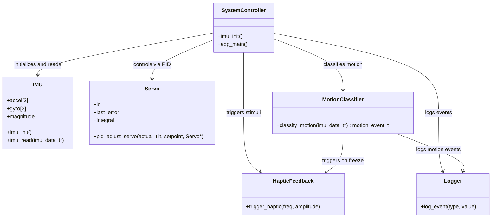

```mermaid
classDiagram
    class SystemController {
        +imu_init()
        +app_main()
    }
    class IMU {
        +accel[3]
        +gyro[3]
        +magnitude
        +imu_init()
        +imu_read(imu_data_t*)
    }
    class Servo {
        +id
        +last_error
        +integral
        +pid_adjust_servo(actual_tilt, setpoint, Servo*)
    }
    class MotionClassifier {
        +classify_motion(imu_data_t*) motion_event_t
    }
    class HapticFeedback {
        +trigger_haptic(freq, amplitude)
    }
    class Logger {
        +log_event(type, value)
    }

    SystemController --> IMU : initializes and reads
    SystemController --> Servo : controls via PID
    SystemController --> MotionClassifier : classifies motion
    SystemController --> HapticFeedback : triggers stimuli
    SystemController --> Logger : logs events
    MotionClassifier --> HapticFeedback : triggers on freeze
    MotionClassifier --> Logger : logs motion events
```
