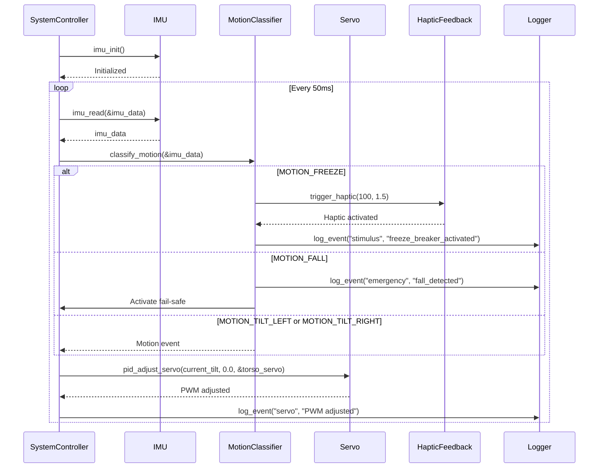

```mermaid
sequenceDiagram
    participant SC as SystemController
    participant IMU as IMU
    participant MC as MotionClassifier
    participant S as Servo
    participant HF as HapticFeedback
    participant L as Logger

    SC->>IMU: imu_init()
    IMU-->>SC: Initialized
    loop Every 50ms
        SC->>IMU: imu_read(&imu_data)
        IMU-->>SC: imu_data
        SC->>MC: classify_motion(&imu_data)
        alt MOTION_FREEZE
            MC->>HF: trigger_haptic(100, 1.5)
            HF-->>MC: Haptic activated
            MC->>L: log_event("stimulus", "freeze_breaker_activated")
        else MOTION_FALL
            MC->>L: log_event("emergency", "fall_detected")
            MC->>SC: Activate fail-safe
        else MOTION_TILT_LEFT or MOTION_TILT_RIGHT
            MC-->>SC: Motion event
        end
        SC->>S: pid_adjust_servo(current_tilt, 0.0, &torso_servo)
        S-->>SC: PWM adjusted
        SC->>L: log_event("servo", "PWM adjusted")
    end
```
