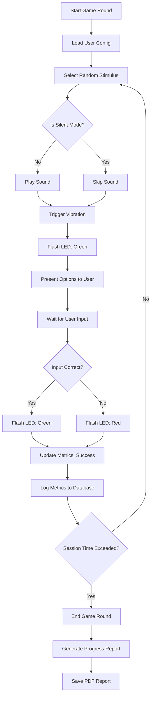

```mermaid
graph TD
    A[Start Game Round] --> B[Load User Config]
    B --> C[Select Random Stimulus]
    C --> D{Is Silent Mode?}
    D -->|No| E[Play Sound]
    D -->|Yes| F[Skip Sound]
    E --> G[Trigger Vibration]
    F --> G
    G --> H[Flash LED: Green]
    H --> I[Present Options to User]
    I --> J[Wait for User Input]
    J --> K{Input Correct?}
    K -->|Yes| L[Flash LED: Green]
    K -->|No| M[Flash LED: Red]
    L --> N[Update Metrics: Success]
    M --> N
    N --> O[Log Metrics to Database]
    O --> P{Session Time Exceeded?}
    P -->|Yes| Q[End Game Round]
    P -->|No| C
    Q --> R[Generate Progress Report]
    R --> S[Save PDF Report]
```
