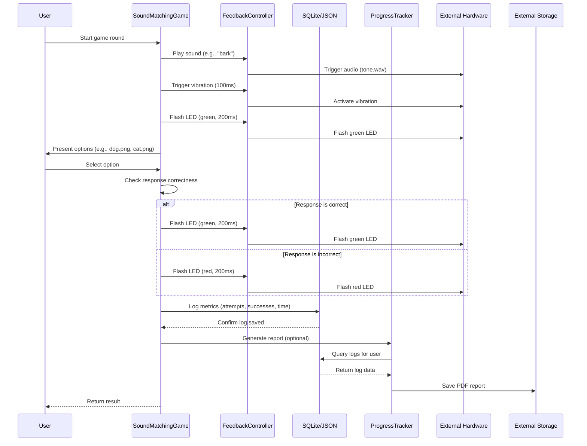

```mermaid
sequenceDiagram
    participant User
    participant System as SoundMatchingGame
    participant Feedback as FeedbackController
    participant Storage as SQLite/JSON
    participant Tracker as ProgressTracker

    User->>System: Start game round
    System->>Feedback: Play sound (e.g., "bark")
    Feedback->>External Hardware: Trigger audio (tone.wav)
    System->>Feedback: Trigger vibration (100ms)
    Feedback->>External Hardware: Activate vibration
    System->>Feedback: Flash LED (green, 200ms)
    Feedback->>External Hardware: Flash green LED
    System->>User: Present options (e.g., dog.png, cat.png)
    User->>System: Select option
    System->>System: Check response correctness
    alt Response is correct
        System->>Feedback: Flash LED (green, 200ms)
        Feedback->>External Hardware: Flash green LED
    else Response is incorrect
        System->>Feedback: Flash LED (red, 200ms)
        Feedback->>External Hardware: Flash red LED
    end
    System->>Storage: Log metrics (attempts, successes, time)
    Storage-->>System: Confirm log saved
    System->>Tracker: Generate report (optional)
    Tracker->>Storage: Query logs for user
    Storage-->>Tracker: Return log data
    Tracker->>External Storage: Save PDF report
    System-->>User: Return result
```
